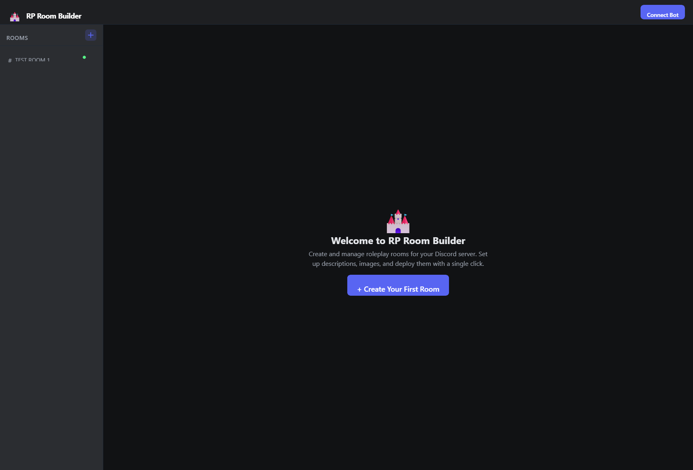

# Welcome

**RP Room Builder** is a local Discord bot with a modern web interface for setting up roleplay rooms on your server. Write room descriptions, upload images, and deploy everything to a channel with automatic pinning — all from your browser.

<!-- Screenshot: welcome page -->

---

## Why RP Room Builder?

Setting up RP rooms on Discord is tedious. You write a description, upload images one by one, then manually pin each message in the right order. If you need to update something, you're editing messages and re-pinning.

RP Room Builder automates all of this:

  

    <h3>🖥️ Web Interface</h3>
    
Manage everything from a sleek browser-based UI at localhost:3000. No terminal commands needed after setup.

  

  

    <h3>📝 Text + Images</h3>
    
Write descriptions with Discord markdown or rich embeds, and attach up to 5 images per room.

  

  

    <h3>📌 Auto-Pinning</h3>
    
Messages are pinned in the correct order automatically. Pin notifications are cleaned up too.

  

  

    <h3>🔄 In-Place Updates</h3>
    
Edit descriptions or swap images without deleting messages. Pins stay intact — no disruption to your channel.

  

  

    <h3>💾 Saved Configs</h3>
    
Room setups persist locally as JSON files. Reload, tweak, and redeploy anytime.

  

  

    <h3>🔒 Encrypted Token</h3>
    
Your bot token is encrypted with AES-256-GCM and tied to your machine. It never leaves your computer in plaintext.

  

---

## Quick Links

- **New here?** Start with the [Getting Started](/getting-started) guide
- **Already set up?** Learn about [Building Rooms](/building-rooms)
- **Download the latest release** from [GitHub Releases](https://github.com/DigitalCommodore/rp-room-bot/releases)
