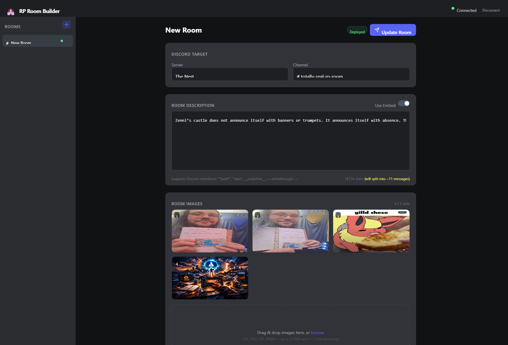

# Building Rooms

## Creating a Room

Click the **+** button in the sidebar (or the **Create Your First Room** button on the welcome page) to create a new room configuration.

<!-- Screenshot: editor view -->

---

## Selecting a Target

Under **Discord Target**, choose where the room will be deployed:

- **Server** — dropdown auto-populates with servers the bot is in
- **Channel** — shows text channels grouped by category

If the bot isn't connected, you can manually enter server and channel IDs instead.

---

## Writing the Description

Type your room description in the text area. You can use Discord markdown:

| Syntax | Result |
|--------|--------|
| `**bold**` | **bold** |
| `*italic*` | *italic* |
| `__underline__` | underlined |
| `~~strikethrough~~` | ~~strikethrough~~ |
| `||spoiler||` | spoiler text |
| `> quote` | blockquote |
| `\`code\`` | inline code |

There's no character limit to worry about — write as much as you need. For plain text, the bot automatically splits long descriptions across multiple Discord messages at natural paragraph and sentence boundaries. Markdown formatting is preserved across splits, so bold, italic, and other styling won't break even if a split falls in the middle of a formatted section.

A character counter below the text area shows the current length and, if the text exceeds 2,000 characters, how many messages it will be split into.

### Using Embeds

Toggle **Use Embed** to switch from plain text to a Discord rich embed. Embeds give you:

- **Title** — appears as a bold heading above the description
- **Color** — the colored sidebar strip (use the color picker or enter a hex code)
- **Thumbnail URL** — small image in the top-right corner
- **Embed Image URL** — large image at the bottom of the embed

The description field supports up to 4,096 characters in embed mode. Embeds are always sent as a single message (no splitting).

---

## Adding Images

Drag and drop images onto the upload area, or click to browse. Supported formats: JPG, PNG, GIF, WEBP (up to 25 MB each).

You can upload up to **5 images** per room. The UI shows how many slots remain.

### Reordering

Hover over an image to reveal controls:

- **Arrow buttons** — move the image left or right in the order
- **X button** — remove the image

Image order matters — it determines the order they appear in the Discord channel and pins panel.

---

## Auto-Save

All changes are saved automatically as you type. You'll see a brief "Saving..." indicator in the top-right corner. Room configs are stored as JSON files in the `configs/` folder.

---

## Next Steps

Ready to send it to Discord? Head to [Deploying & Updating](/deploying).
