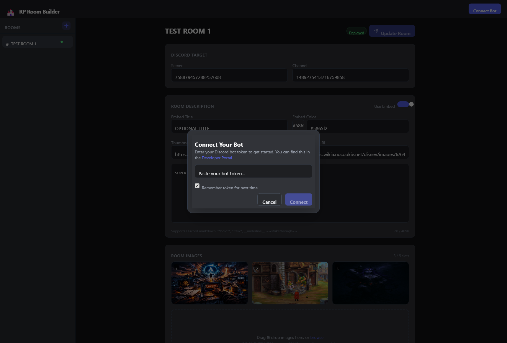

# Getting Started

## Prerequisites

You need [Node.js](https://nodejs.org/) v18 or newer installed on your machine. You'll also need a Discord bot token — if you don't have one yet, follow the [Creating Your Bot](/creating-your-bot) guide first.

---

## Option A: Download a Release

The easiest way to get started.

1. Go to the [Releases page](https://github.com/DigitalCommodore/rp-room-bot/releases)
2. Download the latest `.zip` file
3. Extract it anywhere on your computer
4. Launch the app:

**Windows** — double-click `start.bat`

**Mac / Linux** — open a terminal in the folder and run:

```bash
chmod +x start.sh
./start.sh
```

The launcher checks for Node.js, installs dependencies, builds the UI, and starts the server automatically.

---

## Option B: Clone the Repo

For developers or if you want to stay up to date with git.

```bash
git clone https://github.com/DigitalCommodore/rp-room-bot.git
cd rp-room-bot
npm install
npm run build
npm start
```

---

## Connecting Your Bot

Once the app is running, open **http://localhost:3000** in your browser.

<!-- Screenshot: connect modal -->


1. Click **Connect Bot** in the top-right corner
2. Paste your bot token
3. Check **Remember token for next time** if you want it saved (encrypted) for future sessions
4. Click **Connect**

The green dot and your bot's username will appear in the header when connected. On future launches, the bot auto-connects using your saved token.

---

## Next Steps

Your bot is connected and the UI is ready. Head to [Building Rooms](/building-rooms) to create your first room setup.
